 # 𐔌 . ⋮ 𝒫ℴ𝒸𝓈𝒸𝒶𝓈𝓉 ℳℴ𝓋𝒾ℯ𝓈 .ᐟ ֹ ₊ ꒱

## Iɴᴅɪᴄᴇs

- [Integrantes do grupo](#Integrantes-do-grupo)
- [Protótipo Figma](#link-do-protótipo-no-figma)
- [Sobre o Blog](#sobre-o-blog)
- [Observações](#observações)
- [Funcionalidades](#funcionalidades)
- [Tecnologias Utilizadas](#tecnologias-utilizadas)
- [Páginas](#páginas)

---
## Iɴᴛᴇɢʀᴀɴᴛᴇs ᴅᴏ ɢʀᴜᴘᴏ

* Bianca Amorim N: 02
* Bianca Pereira Moreira N: 03
* Giovanna Gabrielly Burda N: 08
* Kamilly Lacerda N: 16
* Maria Luiza N: 21
* Maykon da Costa Salvador N: 22
* Alan Cordeiro Martins N: 29    

---

## Lɪɴᴋ ᴅᴏ Pʀᴏᴛᴏ́ᴛɪᴘᴏ ɴᴏ Fɪɢᴍᴀ
[⤷ ゛Cʟɪǫᴜᴇ ᴀǫᴜɪˎˊ˗~](https://www.figma.com/design/tRbJEQ7SvRJcazsnI3eTdk/mobile?node-id=0-1&p=f&t=W1xWM0LvMVcoPL9y-0)

---

## Sᴏʙʀᴇ ᴏ Bʟᴏɢ

Este é um site de blog de filmes com uma estética separada por cores para cada filme. 
Foi desenvolvido com o objetivo de mostrar filmes em base dos gêneros, junto com uma 
página de recomendações de acordo com o que a pessoa desejar.

## Oʙsᴇʀᴠᴀᴄ̧ᴏ̃ᴇs
**Em determinadas páginas não há utilização de API, sendo elas:**
 * Alan - Drama
 * Bianca Amorim - Animação
 * Giovanna - Tela inicial
 * Maria Luiza - Ação
 * Kamilly - Romance
 * Maykon - Terror

**Única página que contém**
 * Bianca P. - Recomendações de filmes 
 * Api: https://www.omdbapi.com/

## Fᴜɴᴄɪᴏɴᴀʟɪᴅᴀᴅᴇs

Principais características e funcionalidades do seu aplicativo.
* Integração com API 
* Navegação intuitiva 
* Site público sem a necessidade de login.
* Contém uma área de "Recomendações de Filmes"

---

## Tᴇᴄɴᴏʟᴏɢɪᴀs Uᴛɪʟɪᴢᴀᴅᴀs

 A principal tecnologia utilizadas durante o processo:

 **Tecnologia principal:** 
  - Figma (Prototipagem)
  - React Native

---

## **Pᴀ́ɢɪɴᴀs**
### Tela 1 (Tela de Início) - Giovanna

### Descrição
 * Esta página é a que conecta todas as outras páginas do projeto. Nela, temos um layout mais intuitivo e simples, com um sistema de cards/carrossel que apresenta pequenas descrições sobre cada post do blog e as respectivas opiniões dos blogueiros, além de uma área com um link para a página alternativa de recomendações gerais.
---
### Para quais funcionalidades foi pensada

 * conectar todas as páginas em um único lugar e ser um sistema fácil de interagir

### Observações 
 * Os cards são compostos por uma pequena descrição do post de cada gênero de filme, e o acesso ao post é feito por meio do botão localizado ao final do card.
---
### Problemas/Dificuldades durante o projeto

* A principal dificuldade foi a implementação das informações dentro dos cards e a criação do carrossel interativo.

---

### Soluções para os problemas:
* Para a resolução desses problemas, foi necessária a criação de consts que armazenavam as informações dos cards e eram aplicadas no código em integração com o componente de card. O carrossel foi desenvolvido a partir de diversos testes e aprimorado ao longo do projeto.

---
### Imagens da Página:

 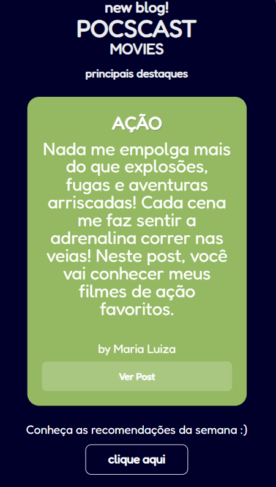

---
### Tela 2 (Ação) - Maria Luiza 
### Descrição
 * A pagina tem três filmes do gênero ação, todos esccolhidos por mim, sobre os meus gostos. Existe em cada filme uma avaliação, tempo de duração, sinopse e opnião.

---
### Para quais funcionalidades foi pensada
 * Tem o objetivo de recomendar três filmes de ação para aqueles que gostam de adrenalina e emoção. 

### Observações 
 * Os três filmes são de extrema ação, em palavras resumidas, tiro, porrada e bomba, muitas cenas que talves necessitassem de blur, mas o filme é muito bom para ser estragado. Os filmes são Tropa de Elite, Busca Implacavel e Invasão a casa branca. 

---
### Problemas/Dificuldades durante o projeto

**Umas das minhas principais dificuldades, foi a questão de colocar o texto ao lado da imagem, pois o texto cortava, fazendo sumir uma parte da escrita, outra dificuldade foi deixar o site dinâmico**

### Soluções para os problemas:
 A questão do texto ao lado da imagem, consegui resolver após arrumar o tamanho da imagem e colocar apenas um styles para as três sinopses, antes havia uma para cada. Deixar o site dinâmico foi algo quue eu não consegui resolver, tentei de diversas formas, mas nenhuma foi certa. 

---
### Imagens da Página:

 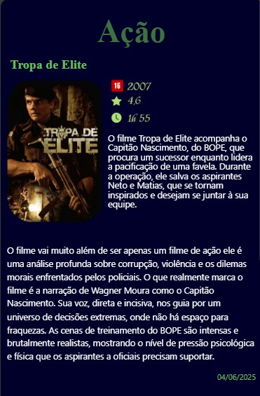
 ---
 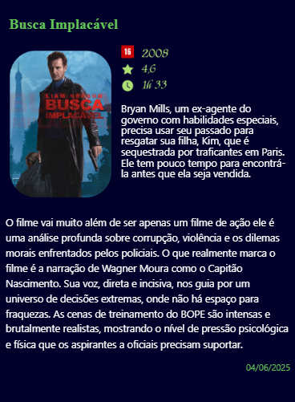
 ---
 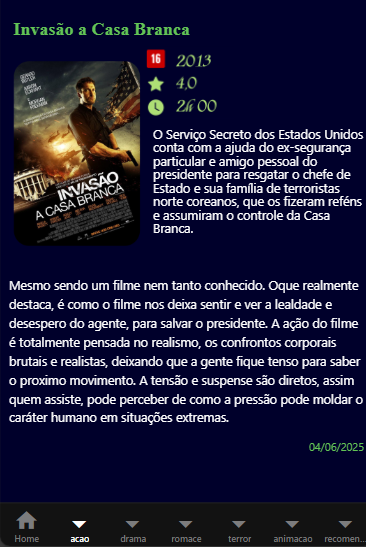

---

### Tela 3 (Animação) - Bianca Amorim
### Descrição
 * A página possui três filmes de animação junto com a sinopse, avaliação,
 tempo de filme e opinião própria sobre os filmes escolhidos.

---
### Para quais funcionalidades foi pensada
 * Tem o intuito de recomendar as animações para alguém que se interesse pela promissa
 dada.

### Observações 
 * Tem três filmes separados, sendo o Noiva Cadáver, Merida e Ponyo.

---
### Problemas/Dificuldades durante o projeto

* Tive leves dificuldades de começo por causa da falta de costume em programação
React Native, conseguindo entender aos poucos a melhor maneira de editar as coisas e programar

### Soluções para os problemas:
 * Conseguir arrumar pesquisando sobre os códigos, apagando e adicionando coisas no chute até
 que desse certo e, se ainda desse problema, perguntava ao Copilot sobre.

---
### Imagens da Página:

 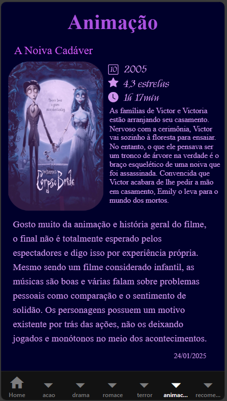
 ---
 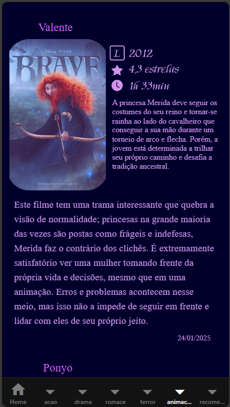
 ---
 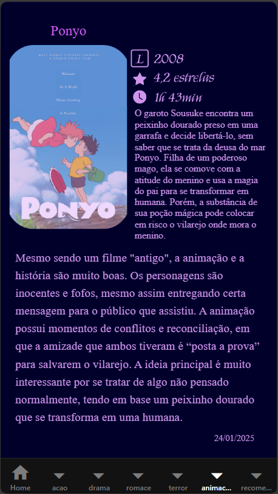

---
### Tela 4 (Drama) - Allan
### Descrição
 * Possui três filmes da minha preferência de dramas, junto com
 a sinopse, avaliação e resenha pessoal.
---
### Para quais funcionalidades foi pensada
 * Foi feito pensando em recomendar filmes que sejam de drama para pessoas interessadas pelo gênero.

### Observações 
 * Todos os filmes são LGBT nos quais são meus favoritos de drama sendo eles: As vantagens de ser invisível, Sociedade dos Poetas Mortos e Stand by me, Segundo que eu deixei um espaço na parte superior acima do Drama para ser compatível quando abrir em algum celular e não ficar em cima.

---
### Problemas/Dificuldades durante o projeto

**Minha principal dificuldade foi a questão de centralização e de deixar a página de forma dinâmica**

### Soluções para os problemas:
 Tentei de muitas formas deixar a página de forma dinâmica e não algo feito manualmente (o que só deu certo para o primeiro filme) Os outros dois não fui capacitado de conseguir, assim apenas o primeiro filme consegui resolver esse problema através de view 

---
### Imagens da Página:

 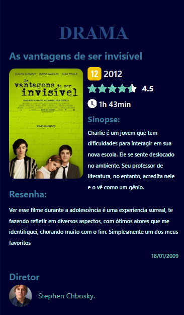
---

 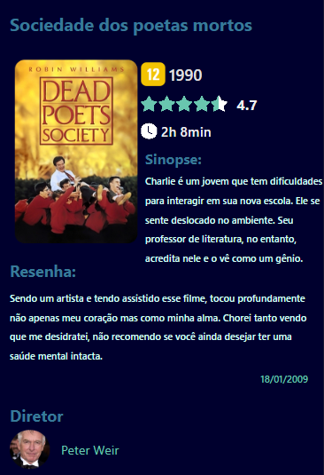
---

 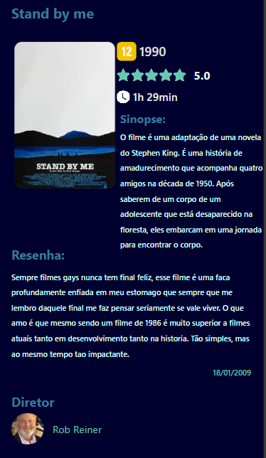
 
---
### Tela 5 (Romance) - Kamilly
### Descrição
 * Os componentes da tela é dedicado à exibição de detalhes e resenhas sobre os filmes.
A tela possui uma estrutura vertical com destaque para os títulos, informações chave do filme (ano, duração, avaliação) e blocos de texto para sinopse e resenha completa.
 E Utilizei um esquema de cores de alto contraste, com textos em rosa claro e rosa choque.
 E foi pensado para ser uma versão de celular.

---
### Para quais funcionalidades foi pensada

 * Foi pensada para ser um blog, onde possamos ler os posts sobre os filmes, uma breve resenha e ver as avaliações dos filmes.

### Observações 
 * Nos filmes, podemos ver a classificação de idade, duração e o ano de lançamento.

---
### Problemas/Dificuldades durante o projeto
* No começo tive algumas dificulades, como arrumar a imagem pois não funcionava, mudar a cor e a fonte dos títulos dos filmes e no alinhamento. Mas, no final deu tudo certo.

### Soluções para os problemas:
* Caso você queira mudar a cor e a fonte dos títulos, você deve no "ThemedText" sem estar dentro da "ThemedView".

---
### Imagens da Página:

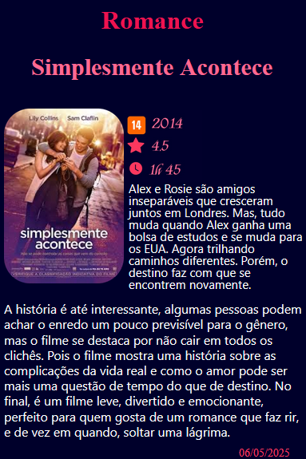
---
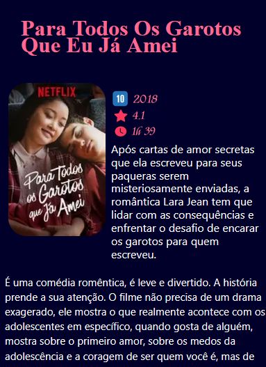
---
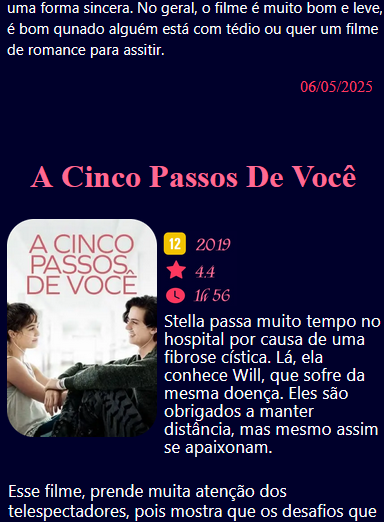
---
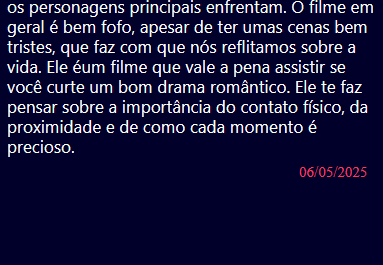

---
### Tela 6 (Terror) - Maykon
### Descrição
 * (o projeto foi pensado com o intuito de ser uma versao de celular do projeto de front, com as mesmas caracteristicas, voltada a ser um projeto que coloca os top filmes da atualidade com as minhas opinioes e avaliaçoes, junto de um breve resumo das informaçoes do filme como ano de lançamento e duração etc...)
---
### Para quais funcionalidades foi pensada
 * (foi pensada para ser um blog de posts de opinioes sobre filmes, recomendando filmes q gosta e colocando notas avaliativas pra cada filme e dando um breve resuminho sobre oque é o filme)

### Observações 
 * (tem informaçoes do filme como idade minima, duraçao e ano de lançamento do filme)
---
### Problemas/Dificuldades durante o projeto

acho que no começo tive um pouco de difiiculdade de entender oque era hml e oq era css e java por causa do formato diferente do react native mas depois eu peguei o jeito, acho q a principal dificuldade minha foi colocar a tela com "scroll" por que eu nao fazia ideia de como fazer, pesquisei na internet e nao achei mas a minha amiga maria luiza me ajudou e me ensinou como fazer.

### Soluções para os problemas:
 (aprendi nesse projeto que sempre se estiver tudo vermelho absolutamente do nada é só vc dar "crtl +shift + p" e dar reload no servidor pq as vezes ele buga mesmo )

---
### Imagens da Página:
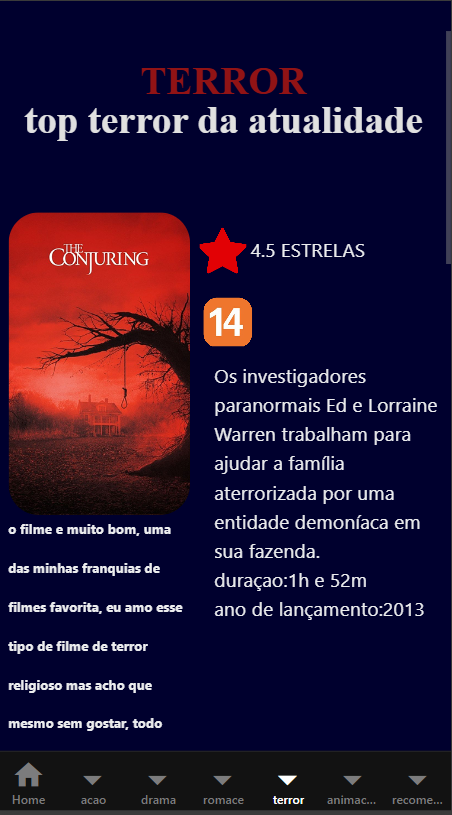
---
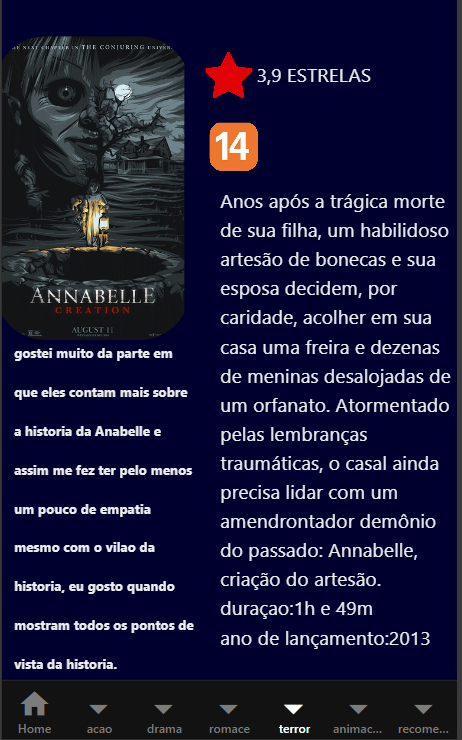
---
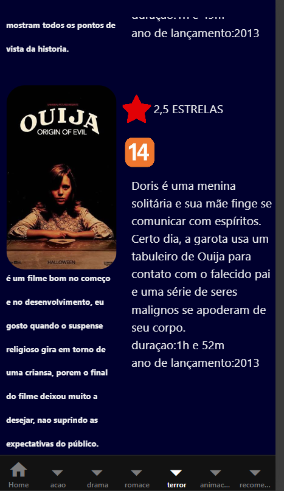

---
### Tela 7 (Recomendações) - Bianca Pereira
### Descrição
 * Minha tela apresenta uma recomendação de cada um dos gêneros apresentados, que foram escolhidos por mim e que gosto bastante.
---
### Para quais funcionalidades foi pensada
 * Fiz com o propósito de mostra as melhores recomendações "daquela semana", então apresenta um recomendação de cada um dos gêneros das outras páginas, e coloquei uma API externa que mostra uma "descoberta" de um filme novo.

### Observações 
 * Os textos que aparecem na parte de baixo de cada um dos posters dos filmes, são opiniões reais minhas e representam o que achei sobre cada um deles, o mesmo serve para as valiações(representadas pelas estrelas), não são uma avaliação real com embasamento, apenas é a avaliação que acho que se emcaixa com o que achei sobre o filme.
---
### Problemas/Dificuldades durante o projeto
* De forma geral o principal problema que tive foi em colcar uma api no projeto, usei todo tipo de IA mas nenhuma dava certo, então percebi que estava pedindo algo muito complexo, estão pedi algo mais simples, e flexível.

### Soluções para os problemas:
 * Então para resolver, fiz apenas um botão que mostra um novo filme que ainda não tinha aparecido no projeto.

---
### Imagens da Página:

 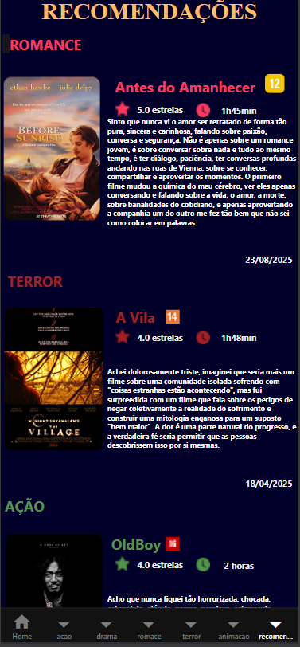

 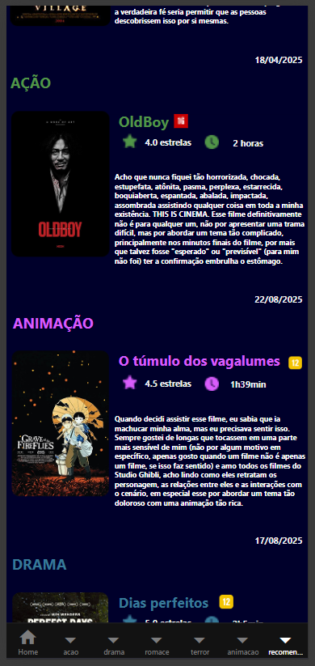

 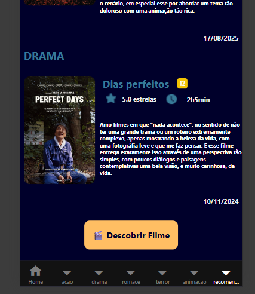

### Sobre a API
 * Como a API aparece
 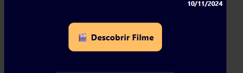

 * API funcionando
 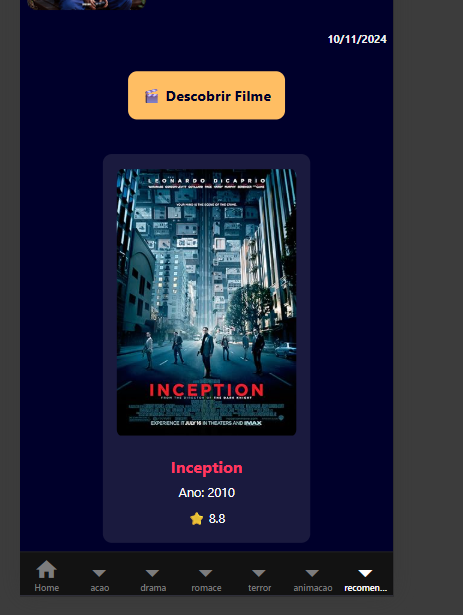

---
